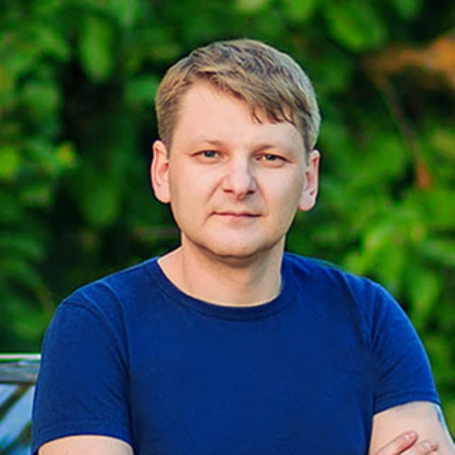

# Vitali Adziyanav CV / Front-End Junior Dev



### CONTACTS

- Location: Minsk, Belarus
- Discord: Vitaly Adamsov#5174
- Telegram: [@adamsov](https://t.me/Adamsov)
- Instagram: [@vitalyadams](https://www.instagram.com/vitalyadams/)
- Github: [www.github.com/adamsov](http://www.github.com/adamsov)
- Tel: [+375298465505](tel:+375298465505)
- E-mail: [adamsoff@gmail.com](mailto:adamsoff@gmail.com)

---

### PROFILE

Determined and creative Front-end developer. I did programming in high school. Repeatedly won prizes in school programming competitions and created my own projects in Basic, Delphi and Pascal. Then devoted my life to graphics and design. Became a professional photographer and gained skills in 2D and 3D design. And now with a lot of life experience and knowledge in design, I decided to continue my path in front-end development. I am confident that I can make websites beautiful and their code work!

### SKILLS

- HTML5
- CSS3/SASS
- Basic JS
- Basic C#
- Git/GitHub
- Adobe Photoshop
- Adobe Illustrator

---

### CODE SAMPLES

```
function multiply(a, b){
return a * b;
}
```

---

### EDUCATION

2018-2022
Belarusian State University of Informatics and Radioelectronics (BSUIR)
Student 9/10 semesters
DEPARTMENT: Information technology software
MAJOR: Software Engineer

---

### WORK

#### 2006 - Current | Photographer/Videographer, YouTube production
#### Self-Employed

SPECIALIZED IN:

- wedding photography/videography,
- individual and family professional photo shoots in studio and outdoors
- photo processing, retouching, and video editing
- YouTube production

  SOFTWARE USED:

- Adobe Illustrator
- Adobe Photoshop
- Adobe Bridge
- Adobe Premiere
- 3D Studio Max
- 4D Cinema
- Unity
- Vegas Pro

EQUIPMENT: Canon 5d MARK III X2; lenses: 24-75/2.8 II, 16-35/2.8, 70-200/4, 50/1.4, 85/1.8; studio light equipment.

### LANGUAGES

Russian - Native
English - B1
